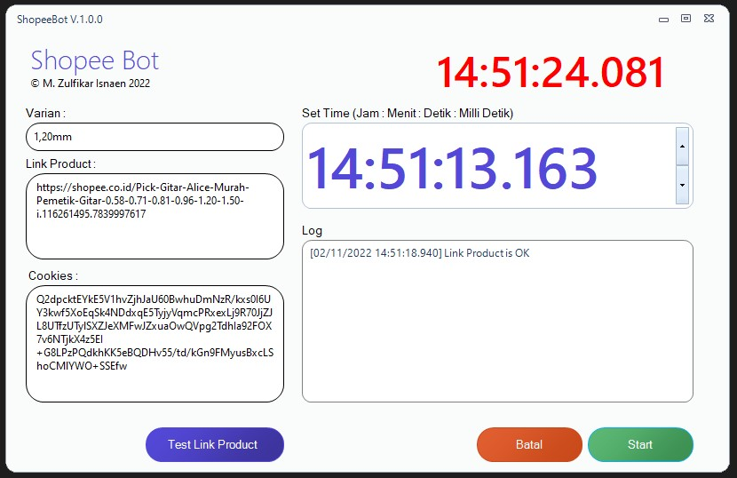

 

# How to use Program
- Open the Application in `ShopeeBot/bin/release/ShopeeBot.exe`
- Login into your Shopee Website https://shopee.co.id and Login
- Ctrl + Shift + C in your Browser or inspect
- Klik Network
- Reload the Browser
- Klik on the liist name, and klik Cookies on the right, and Find `SPC_EC`

- Copy your cookies in `Cookies`
- Find your product that you want it, copy and paste in `Link Product`
- Put the Varian, if there's no varian please empty the field
- Klik Test Link Product
- Set the Timer and 
- Click Start

# How to use ShopeeBot Source Code in Visual Studio
## Add reference `.dll` in your project:
- ComponentFactory.Krypton.Docking.dll
- ComponentFactory.Krypton.Navigator.dll
- ComponentFactory.Krypton.Ribbon.dll
- ComponentFactory.Krypton.Toolkit.dll
- ComponentFactory.Krypton.Workspace.dll   

**Open your Visual Studio and Running!**

# License & Copy Right
© M. Zulfikar Isnaen [MIT License](LICENSE).